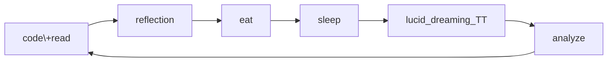

Do I know you?


```python
print("Hello, world")
```

I **will** try some basic ~weird~ *markdown+* stuff that I already know in [this intro](./index.md).  

Let's make a table.
|if|then|
|-|-|
|the earth stops rotating|we will shoot ourselves out of earth|
|a black hole touches me|do I know?|

> \> Can I add two numbers in ***Latex***?  
> \> $2 + 2 \neq 4!$  

can we use mermaid graph?!


---
See the [original documentation](https://quartz.jzhao.xyz).
